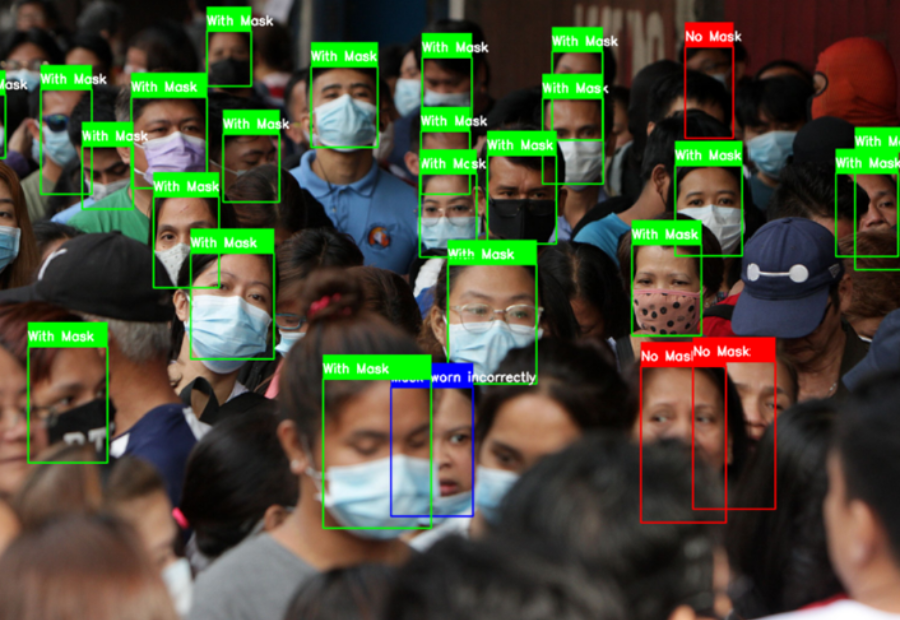
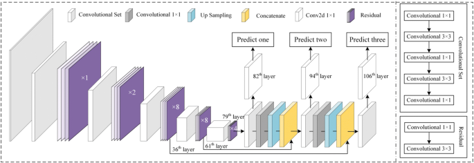
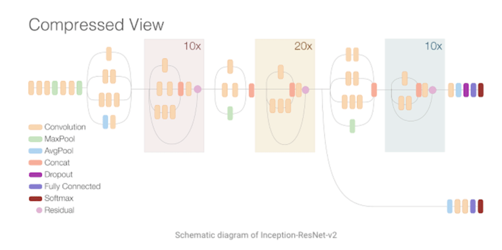
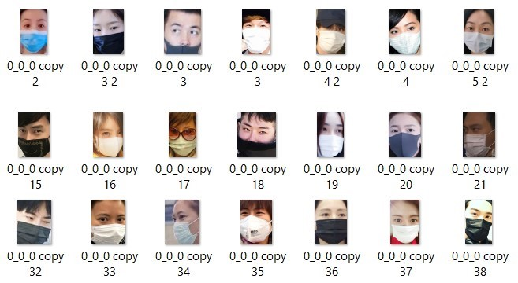
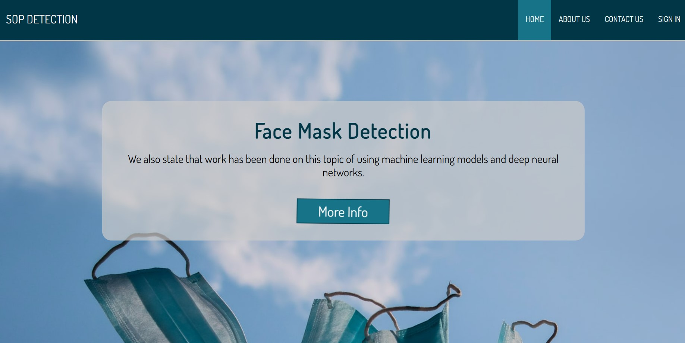
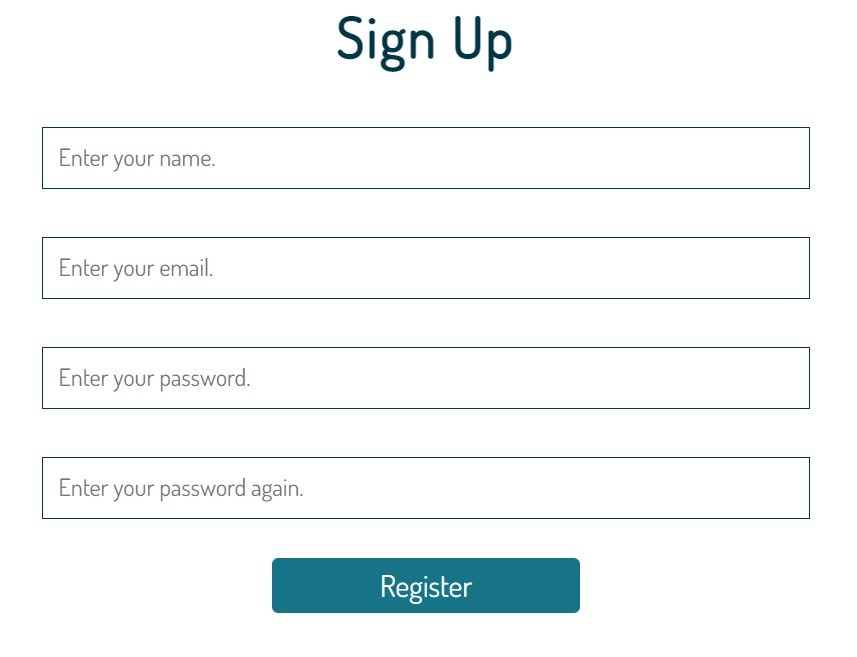
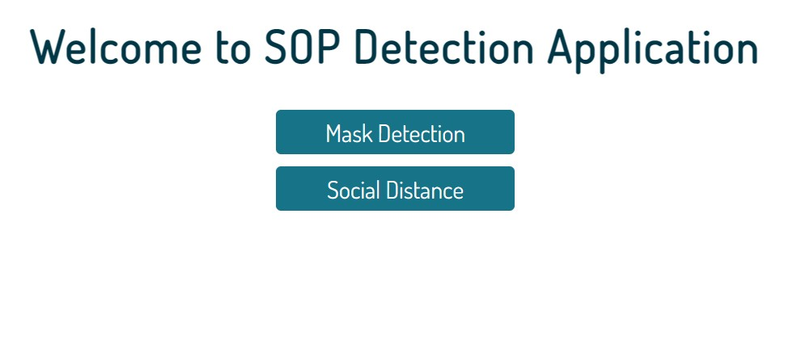
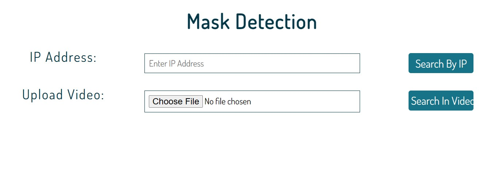
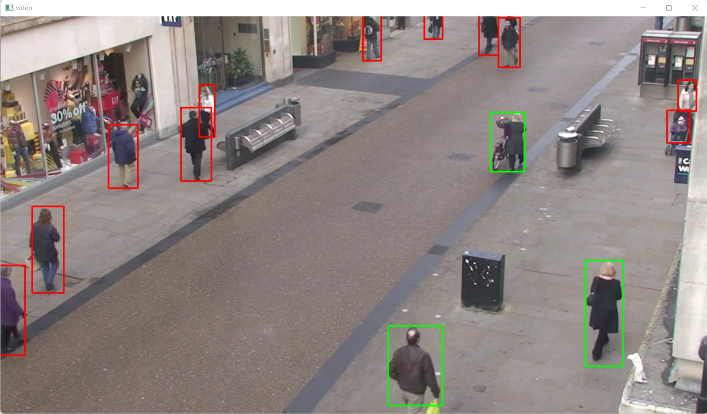
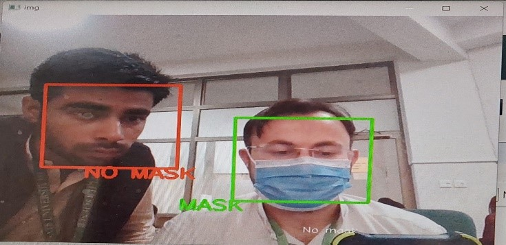

# Sops-Monitoring-and-Detection-YoloV5
To stop the spread of covid-19, we want to practice SOP’s. Standard operating procedures (SOP’s) are a recommended solution by WHO to stop the expend of Corona Virus and ensure the safety of every individual in society. Our project is a step to minimize the contact of individuals with each other’s in different social gathering places. In this project our main goal is to detect the persons in a video which are not following SOPs in different places.

There are different ways to reduce the contact of persons with each other’s, for example close all gathering places. But if we do not want to close the places then it is our task to detect every person in the place and keep eye on them and check whatever the persons following SOP’s or not. For this task we are using video processing Computer Vision and machine learning concepts. We described the problem in abstract that how to ensure that peoples following SOP’s or not in any social gathering place. For this the possible solution is SOP’s detection program that detects every individual with respect to another individual and ensures social distancing is maintained or every single person having face mask, and no one would handshake with each other.

Social distancing is a strategy used to control the expending of covid-19. As the name suggests, social distancing implies that individuals should physically distance themselves from one another, reducing close contact, and thereby reducing the spread of this contagious disease.
This project is used in other fields of surveillance like sports, security checking, and crowd analysis.

  

## Yolo Architecture
YOLO stands for You Only Look Once, this model is used for Object Detection as well as Object Tracking with the help of CNN, our research uses YOLO for calculating the social distancing with the help of Object Detection and feature extraction from the data, whereas tracking the face and people in the frame for counting the objects and keeping a record of that object in the next frame is done by Object Tracking. The minimum distance to keep in social distancing is 2 meters, the model was trained and used for object detection as well as object tracking. 

  

YOLOv3 is fast and accurate in terms of mean average precision (mAP) and intersection over union (IOU) values as well. It runs significantly faster than other detection methods with comparable performance (hence the name – You only look once). Moreover, you can easily trade-off between speed and accuracy simply by changing the model’s size, without the need for model retraining.

## Inception Res-Net-V2
The Inception-ResNet v2 architecture was released by Szegedy et al. and is based on the combination of two ideas: residual connections and the Inception architecture. Inception-ResNet-v2 is a convolutional neural network that is trained on more than a million images from the ImageNet database. The network is 164 layers deep and can classify images into 1000 object categories, such as the keyboard, mouse, pencil, and many animals. As a result, the network has learned rich feature representations for a wide range of images. The network has an image input size of 299-by-299, and the output is a list of estimated class probabilities.

  

 
## Model Consider

  

## Dataset
Facemask dataset is available in Kaggle. We have Total 14 thousand face images. These images divided based on face have mask or not. For the with mask, we have 8000 thousand images and without mask we have 7000 images. 

  

## Front-end

  

### Register

  

### Dashboard

  

### Detection

   

## Tools and Technologies
1) Jupyter notebook (anaconda3) 6.4.8
2) Visual Studio Code 1.67.2
3) Python 3.7
4) HTML 5
5) CSS 4.13
6) Flask 1.1.x
7) YOLO
8) Inception ResNet v2

